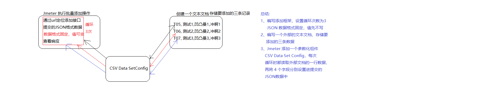
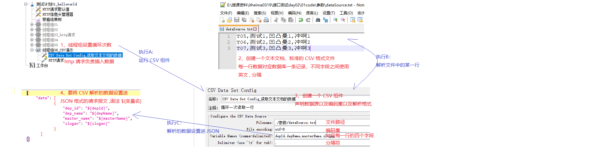
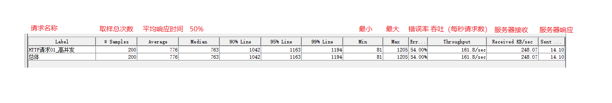
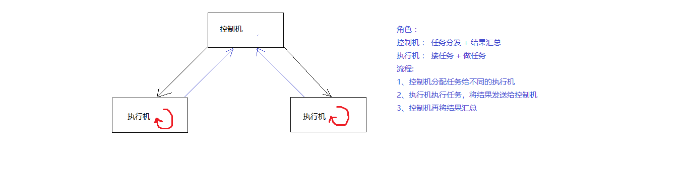
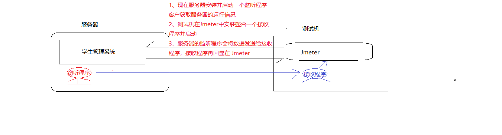
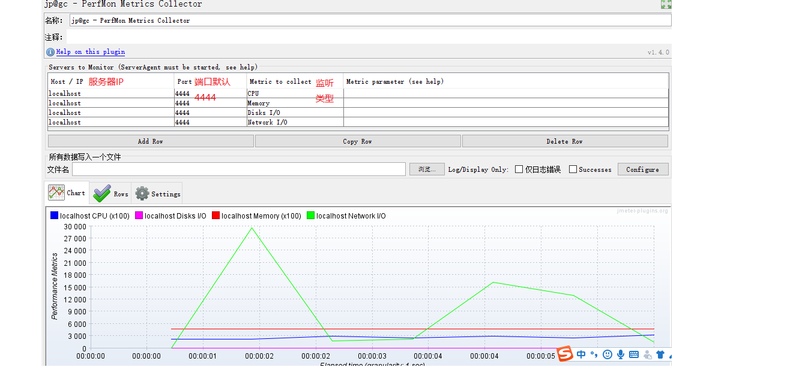
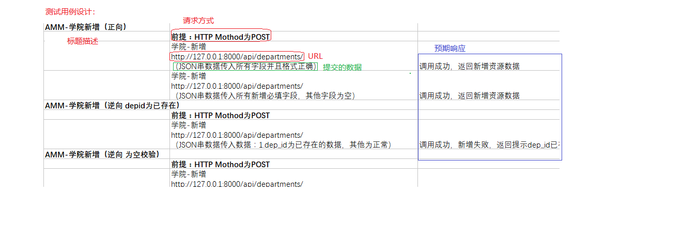
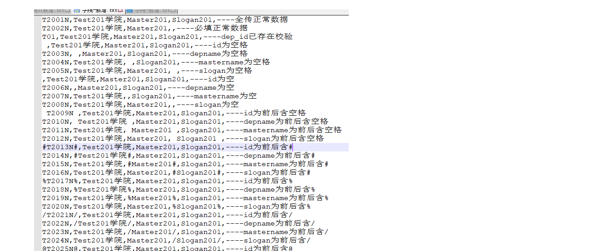

### 1、接口测试:接口（重点）

##### 	A、是什么?

数据交互的入口和出口，是一套规范一套标准

分类:

硬件 ----- USB 接口, 电源接口,网线接口.....

软件 ----- 就是前后端共同遵守的一套数据交互的规范(架构师制定接口)

##### 	B、为什么？

高效、灵活 _ 扩展性强 _提高内聚性降低了耦合性（记住）

 不使用接口的缺点：

```
1. 研发标准不统一，团队磨合难度高
2. 研发周期长
3. 可扩展性差
```

时优点：

```
1. 统一设计标准；
2. 前后端开发相对独立；
3. 扩展性灵活；
4. 前后端都可以使用自己熟悉的技术；
```

##### 	C、怎么用？

C-1、接口规范是架构师制定的

C-2、前端和后端开发时共同参考的依据

​	

### 2、接口测试:接口测试（重点）

##### 	A、是什么?

测试后端实现是否符合接口规范(不是测试接口本身)

##### 	B、为什么？

程序安全、效率

##### 	C、怎么用？(实现流程)

模拟客户向服务器发送数据，然后查看响应

要素1: 定位服务器资源(通过 URL 实现: http://www.baidu.com | http://127.0.0.1:8000/资源路径)

要素2: 模拟用户提交数据

要素3:查看响应的结果是否符合预期

**D、接口测试分类**(记住)

类型1:web接口测试 （BS 架构）

​	  | ----- 服务器接口测试:测试自己公司实现的接口

​	  | ----- 第三方接口测试:测试别的公司实现的接口

类型2:模块接口测试    (CS 架构)

​	

### 3、接口测试:环境搭建

##### 	A、是什么?

搭建接口测试的测试环境，运行程序

##### 	B、为什么？

必须的	

##### 	C、怎么用？

1)、运维或开发实现程序部署，正常运行

2) 、自己搭建

​	2-1、安装 python

​	2-2、安装依赖 :pip install -r requirements.txt -i https://pypi.douban.com/simple

​	2-3、启动项目 : python run_server.py

​	2-4、测试: http://127.0.0.1:8000/api/departments 如果正常响应数据了，那么程序安装并启动正常

3)、学生管理系统简介

​       核心: 学生表 班级表 学院表

​       操作: 3张表的增删改查

​	

### 4、接口测试:插件

##### 	A、是什么?

是测试接口的测试工具

火狐 ------ RESTClient

谷歌 ------ POSTman

Java  实现的测试工具: Jmeter(重点)

##### 	B、为什么？

测试工具功能强大一些，使测试更快捷方便

##### 	C、怎么用？

注意:二者安装时，都要注意版本

​	Google 插件资源下载被屏蔽了，安装提前下载完毕的,

​	<u>火狐安装 RESTClient</u>

​	


### 5、接口测试:RESTful 风格(重点)

##### 	A、是什么?

**RESTful 风格**： 开发测试时，大家都会遵守一些默认的规范，这些是约定成俗的，大家的习惯做法，非强制性的 RESTful 风格就是这些习惯中的一种s

RESTful 风格中规范了，URL 的实现方式，提交的数据的实现方式，响应的数据的实现方式 ......

##### 	B、为什么？

为了程序的易读性和易维护性	

##### 	C、怎么用?(记住)

RESTful 风格是约束接口操作的四种操作以及三个要素

**增:**

​	要素1:  URL +  POST

​	要素2: 多个数据

​		   方式1: 键=值&键=值

​		   方式2: JSON 格式

​	要素3: 200 | 201 +  添加的记录

**删:**

​	要素1: URL +  GET|DELETE

​	要素2:  方式1: 键=值&键=值

​	要素3: 200|204 + 无

**改:**

​	要素1:URL + POST|PUT(更合适)

​	要素2:

​		   方式1: 键=值&键=值

​		   方式2: JSON 格式s

​	要素3:200 | 201 + 修改后那条记录

**查:**

​	要素1: URL + GET

​	要素2:常用方式1 URL?键=值&键=值....

​	要素3:200 + 一条或多条记录


状态码:

404 ------ 资源路径有误

505 ------ 服务器异常


GET 和 POST 区别 ：

1、POST 安全性高

2、POST 提交的数据量没有大小限制

3、

​	

### 6、接口测试:JSON

##### 	A、是什么?

A-1、JSON 是一种数据载体

A-2、互联网本质就是数据传输，数据传输需要数据载体,比如：页面信息就是存储在 html 这种数据载体中的

A-3、HTML 格式:

​	 <html>

​		<head>

​		<title>hello</title>

​		</head>

​		<body>	

​			<font color='red'> hello world </font>

​		</body>

​	 </html>	

​	xml 格式:

​	<person>

​		<name>huluwa</name>

​		<age>8</age>

​	</person>

​	缺点:

​	标签标记语言，有效数据占有率低

  A-4、 JSON 优化数据传输

​	{"title":"hello","font":"hello world"}	

​	{"name":"huluwa","age":"8"}	

##### 	B、为什么？

JSON 传输数据效率更高，所以部分场景下使用 JSON 替换 html 和 XML_(ajax)

但是 JSON 语法描述性不及 标签语言，所以部分场景还得使用 html 和 xml

如果传递的是少量数据的话，可能使用 JSON

##### 	C、怎么用？

语法:

格式1(JSON对象):{"键1":"值1","键2":"值2".....}	

格式2(JSON数组):[值1,值2,值3.....]

格式复合: {"name":"huluwa","age":"8","aihao":["救爷爷",“吐火”,"吐水"]}

​		 [{"name":"huluwa","age":"8"},{"name":"aotuman","age":"10"}......]


### 7、接口测试:实战

​	目的:RESTful 风格练习

A、安装并运行学生管理系统

B、获取并读懂接口规范

​     B-1、从前期文档中提取接口清单 （了解此过程即可）

​     API 文档: application programing Interface 应用程序编程接口

​     B-2、接口清单读懂

​     要素1: URL + 请求方法

​     要素2: 提交的数据

​     要素3: 响应的结果


C、逐一测试接口


总结:

新增数据时，数据是 JSON 格式的，必须设置 浏览器的 http 请求头,不然会当成普通文本处理

​      Content-Type   applicaton/json;charset=utf-8 (记住)

​      Content-Type :  提交的内容类型 

​      application/json : 数据类型是 JSON 格式 | 大类型/小类型 img/jpg  img/png .....

​      charset=utf-8  :  设置编码集,utf-8 支持世界所有字符

### 1、Jmeter: 概述

##### A、是什么?

Jmeter 是 Apache 公司使用 Java 开发的一款测试工具

##### B 、为什么?

高效、功能强大 

模拟一些高并发或多次循环等特殊测试场景 

##### C、怎么用?

C-1、下载 Jmeter，解压缩

C-2、安装 Java 环境(Jmeter 和 Java 环境的关系，类似于mp3 文件和 播放器关系)

​	 注意:安装路径不能有中文字符、空格

​		 安装了 JDK + JRE

C-3、简单了解 Jmeter 的目录结构

​	 bin ：  存储了 Jmeter 的可执行程序，比如启动程序

​	 lib   ：  存储了 Jmeter 整合的功能(一些 .jar 文件的小程序)

C-4、启动 Jmeter

​	启动方式1:bin/ApacheJmeter.jar 双击

​	启动方式2:jmeter.bat windows 下的启动程序

​			  jmeter.sh   linux 下的启动程序

C-5、编写一个 Jmeter 版本的测试案例

​	

##### D、Jmeter 的作用优点以及缺点(了解 )

作用：

```
1. 接口测试  
2. 性能测试  ：内在 ----- 程序的算法
3. 压力测试  ：外在 ----- 外在负载
4. Web自动化测试  
5. 数据库测试  : 测试数据库 
6. JAVA程序测试
```

优点：

```
1. 开源、免费 
2. 支持多协议 : http https ftp ftps .....
3. 小巧
4. 功能强大
```

缺点：

```
1. 不支持 IP 欺骗
2. 不支持前端测试
```

### 2、Jmeter组件:线程组(重点)

##### A、是什么?(记住)

------

进程: 一个正在执行的程序就对应一个进程

线程: 进程中的执行线索 （一个进程有多个执行线索）

线程组:按照线程性质对线程进行分组


并发执行: 多个线程同时执行 **特点: 执行结束的顺序和线程的启动顺序不一定一致**

顺序执行: 按照线程的启动顺序挨个执行

##### B 、为什么?

方便管理

##### C、怎么用?（基本使用）

C-1、三者关系： 进程有多个线程组，线程组可以有多个线程

​	 进程 ---- 测试计划

​	 线程组 ---- 线程组

​	 线程 ------- 线程组属性的线程数

C-2、默认情况下，线程组中的线程是并发执行的

​	  每一个线程都要执行组内的  http 请求	

C-3、怎么设置线程组顺序执行

​	 勾选测试计划的第一个复选框( 独立运行每个线程组)

C-4、线程组练习 学院增删 改查

##### D、练习：学生管理系统增删改查优化

可以使用 http 请求默认值抽取共同的 ip 端口号 协议 编码集 等信息 

测试计划 ---->  右击 -----> 添加  ----->配置元件 ------> http 请求默认值

作用: 通过复用属性简化实现，提高测试效率

##### E、线程组高级(初始化与销毁线程组)

E-1、线程组属性

属性1:线程数 ----- 模拟用户数

属性2:时间值 ----- 在指定时间内启动所有线程

属性3:循环数  ---- 单个用户访问的次数


E-2、调度器

1)、循环次数设置为 永远

2）、设置启动延迟 x和持续时间y

​	在 x 秒后访问服务器，并且持续  y 秒

3)、设置启动时间 M,和 结束时间 N

​	在 M 时开始访问，在  N 时结束

注意:2 和 3 实现不能同时使用，否则矛盾了


### 3、Jmeter组件:参数化概述(了解)

##### A、是什么?

参数化就是动态的获取并设置数据

##### B 、为什么?

比如执行批量操作时，批量插入或批量删除，之前数据都是手写的，每执行完都需要修改一次，效率太低

参数化就是可以以程序代替人工获取并设置数据: 安全 + 高效

### 4、Jmeter组件:参数化实现之CSV Data Set Config(重点中重点)

##### A、是什么?

Jmeter 参数化实现组件之一

##### B 、为什么?

通过这个组件可以动态获取并设置数据，实现类似批量添加操作(执行一次，将多条数据插入到数据库)

##### C、怎么用?

C-1、实现思想



C-2、实现流程



##### D、其他

CSV Data Set Config ----- CSV 数据配置 

CSV -----> 逗号分隔值文件格式


### 5、Jmeter 组件:线程组实现高级

Set Up 	    线程组 : 最先执行的线程组 

​				  加载程序主体执行所需的资源

Tear Down 线程组 : 最后执行的线程组

​				 程序正式关闭之前，可以将数据保存进内存

### 0、Jmeter组件:参数化

##### A、是什么?

参数化就是动态的获取并设置数据

##### B 、为什么?

参数化就是可以以程序代替人工获取并设置数据: 安全 + 高效

##### C、Jmeter参数化组件

CSV Data Set Config ----- CSV 数据设置组件

用户参数

用户定义的变量

函数

### 1、Jmeter组件:参数化之用户参数

##### A、需求(为什么)

向学生管理系统的学院表批量插入数据

##### B、实现(怎么用)

<u>B-1、实现思想(和 CSV 类似)</u>

将数据设置进第三方，然后循环读取数据,和 CSV 的区别:

CSV 是将数据设置进外部的文本文档，而用户参数是将数据设置进 Jmeter 内置组件

<u>B-2、实现流程</u>

1)、搭框架(测试计划，线程组，http请求_JSON 数据先不设置)

​       重点:执行次数是 3 次(<u>不是设置循环次数，而是设置线程数</u>)

2)、使用 Jmeter 内置组件存储要插入的数据


3)、读取组件中的数据设置进 Http 请求的 JSON

​       格式: ${变量名}


### 2、Jmeter组件:参数化之用户定义的变量

##### A、需求(为什么)

对学生管理系统执行增删改查相关操作时，资源路径不一定相同，单都是 /api/departments/ 开头,每次都编写此路径效率偏低,怎么优化？

##### B、实现(怎么用)

1)、将共同数据  /api/departments/ 使用一个组件存储

2)、编写路径时，直接调用组件存储的值s

注意: 一般存储全局使用的变量


### 3、Jmeter组件:参数化之函数

##### A、是什么?

函数是程序中最基本的封装单元，封装了一些常用功能，比如:计数器

##### A、需求(为什么)

循环10次查询学生管理系统的学院信息，结果树中，每次请求信息都是一样的，需要添加标号以示区分

##### B、实现(怎么用)

1)、打开Jmeter内置的函数组件

方式1: 选项 + 函数助手对话框

方式2: Ctrl + shift + F1 

方式3: 工具栏倒数第二个图标

2)、选择要使用的函数， 给函数传参，用Jmeter生成调用格式

__counter 函数的参数1: true 每个用户单独一个计数器， false 所有用户共用一个计数器 

3)、在需要调用函数的位置使用Jmeter生成的调用格式

调用格式： ${__函数名(参数)}


### 4、Jmeter组件:四种参数化方案比较

1、CSV 和用户参数使用思想一致，流程上后者更简单，但是实际应用，使用 CSV 居多，因为数据量大时，CSV 更方便

2、 用户定义的变量一般用来存储全局变量，但是使用场景较少

3、函数实现更为灵活且 内置了好多实现

4、总结: 最常用的是 CSV + 函数

------

### 5、Jmeter组件:直连数据库

##### A、是什么?

让 Jmeter 直接和数据库交互

##### B、为什么?

之前是通过接口操作数据库，可能出现的问题: 比如查询可能有漏查误查的情况，解决方案是人工比对，效率低且有安全隐患，解决方案：让程序代替人工

##### C、怎么用?

C-1、Jmeter 本身不具备直连数据库的功能,整合第三方实现

​	 不同的数据库对应不同的 jar 包实现 

C-2、配置数据库的一些连接信息

​	 variable name: 给当前连接组件命名,请求需要使用 

​	 database url   : 数据库路径

​	 Driver Class    : 第三程序的启动入口

​	 username: 账号 

​         password: 密码 

C-3、创建取样器(JDBC Request)连接数据库

​	   属性1 ：调用的配置的变量名 

​	   属性2 :  SQL 语句的类型 

​			 select Statement 查询

​			update Statement 修改(增 删 改)

​	   属性3：执行的 SQL 语句

C-4、结果再处理

​	就是要将 JDBC 操作的结果取出，并且传递给另外一个取样器

​	怎么实现:

​	1)、JDBC Request 中设置属性 variable names:  变量名

​	2)、JDBC Requst 操作数据库时，会将查询的结果赋值给步骤1设置的变量

​	       赋值规则:由于结果可能有多个，第 N 个结果赋值给  变量名_N

​				变量名_# 对应结果个数

​	       上述规则是固定格式: 记住

​	       怎么查询赋值规则: 添加取样器 Debug(调试) Sampler，可以查看底层实现细节

​	3)、其他取样器使用数据调研格式: ${变量名_N}

​	

### 6、Jmeter组件:关联(重点)

##### A、是什么?

就是一个请求的结果是另一个请求提交的数据，二者不再是独立存在的

##### B、为什么?

为了实现多样的业务逻辑(可能由多个请求组合而成)

##### C、怎么用?

实现方案1: Xpath 提取器

实现方案2: 正则表达式提取器


如果从标签(html | XML)语言提取数据最好使用  Xpath 提取器,如果想要的数据是文本格式,正则表达式提取器更方便


### 7、Jmeter环境

------

##### A、什么是环境变量?path什么用?

系统设置之一,通过设置 PATH，可以让程序在 DOS 命令行直接启动

##### B、path怎么用?

如果想让一个程序可以在 DOS 直接启动，需要将该程序的目录配置进 PATH

##### C、PATH 和我们有什么关系?

要配置 JDK 的环境变量(开发必备的)  

------

需求1:配置 JDK 的PATH环境变量，要求在任意目录下可以执行 javac 程序

需求2:配置Jmeter 的 PATH 环境变量 

需求3:配置 Jmeter 的 lib 目录下的部分 jar  的环境变量

### 1、Jmeter组件:断言(重点)

##### A、是什么?

程序代替人工判断响应结果是否符合预期

##### B、为什么?

安全、高效、功能强大

##### C、怎么用?

分类：

C-1、断言响应的状态码

C-2、断言响应的内容

C-3、断言响应的内容的字节数

C-4、断言响应的时间

### 2、Jmeter组件:集合点

##### A、是什么?

Jmeter 内置组件之一，可以启动多个用户，让多个用户在同一刻去访问服务器

##### B、为什么?

可以模拟高并发实现，测试服务器性能

##### C、怎么用?

场景：模拟 N 个用户在同一时刻查询学院信息操作 

C-1、搭建框架(测试计划、结果树、线程组、http请求)

​	  线程组通过线程数模拟多个用户

C-2、添加集合点组件

​	 定时器  -----> 同步定时器 

​	 组件属性1: 一组用户数

​	 组件属性2: 超时时间  

C-3、运行查看结果

​	运行流程:

​	1)、启动线程 ----> 右上角

​	2)、所有线程启动完毕，再统一执行

​	查看结果添加聚合报告:

​	 

C-4、注意

超时时间可以设置为 0 : 无限等待

建议 ： 线程总数整除集合点的一组线程数，否则会挂起

### 3、Jmeter组件:函数

##### A、是什么?

是程序中的封装单元(最小的)，封装一些功能实现

##### B、为什么?(了解)

优点1:易读 易维护 

优点2:实现功能复用

##### C、怎么用?

流程:

1)、打开Jmeter 内置的函数功能模块

2)、选择要调用的函数，传参数，生成调用格式

3)、哪里需要粘哪里

函数分类:

------

__counter() : 计数器

__random(): 随机数函数 

​		     包含左右临界值

__time() : 获取时间的函数

​		时间格式: yyyy/MM/dd HH:mm:ss == 年/月/日 时:分:秒

------

__CSVRead() ：和 CSV Data Set Config 类似可以读取 CSV 文件数据

 需求:使用 CSVRead 函数实现学院信息的批量插入(比如: 3条)

思想:

1)、搭建框架(线程组设置循环次数),JSON 格式数据只是模板，具体数据动态获取

​       注意:执行次数设置与信息头设置

​	CSV Data Set Config 执行多次是使用的循环次数，而 CSVRead 执行多次使用的是线程数

2)、将数据存储在外部的文本文档(CSV 格式)

3)、使用 CSVRead 函数逐行获取并解析 CSV 文件，插入到提交的 JSON 数据中

​	CSVRead 函数设置 CSV文件路径时，必须得使用绝对路径，不可以使用相对路径

------

__setProperty() : 属性设置

__property()	: 属性获取

 需求：http 请求1 访问百度，将请求1响应的 title 值传递给请求2，但是两个请求不属于同一个线程组

​	      http 请求2 访问 google  /?wd=百度一下你就知道

 实现思想 ：

​	  将线程组内部的数据导出去，存储在共享空间中，其他线程组要使用数据，就从共享空间获取

实现流程：

​	 1)、将数据从当前线程组导出 __setProperty

​		 变量名

​		 变量值  ${变量名}		

​		 <u>使用 BeanShell Sampler 调用函数</u>

​	 2)、另外一个线程组将导出到共享空间的数据引入 __property

​		根据变量名获取 

​	注意:

​		 查看共享数据，工作台 ----> 添加 -----> 非测试元件 ----> property display

​		


------


### 4、Jmeter:分布式

##### A、是什么?

多台测试机协作(集群方式)完成测试任务

##### B、为什么?

安全、高效、功能强大

##### C、怎么用?

C-1、基本架构:



C-2、环境搭建:

​	1) 、搭建伪分布式环境，一台设备模拟 3 台

​	2)、在同一台设备开启 3 个 Jmeter 即可

​	       复制 3 个 Jmeter，因为要同时启动然后网络间进行数据交互，修改端口号

​	3)、伪分布式下配置端口号

​		执行机 A，设置一个端口号: 6666

​		执行机 B，设置一个端口号: 7777

​		控制机要寻址执行机 ,配置: remote-hosts=执行机AIP:6666,执行机BIP:7777

C-3、分布式测试:

​	1) 、需求:平均分配 1000 个用户分别给 执行机A 和 执行机B 执行

​		控制机编写相关脚本

​	2)、分配给执行机

### 1、Jmeter组件:逻辑控制器(重点)

##### A、是什么？

**逻辑控制器**可以控制取样器的实现顺序(分支+循环)的一种组件

类似于计算机语言的流程控制语句，流程控制就是控制代码的执行顺序(分支+循环)

##### B、为什么?

实现多样的业务逻辑

##### C、怎么用？

**C-1、分类**

类别1:分支控制器  ----- if控制器:符合条件就执行

类别2:往复控制器  ----- forEach控制器 + 循环控制器:循环执行

**C-2、实现**

##### 需求1:

​	测试计划中三个 http 请求,分别访问百度、淘宝和京东,不是无差异的都执行，而是有选择性的执行，定义一个用户定义的变量，如果值是 百度，就访问百度，是淘宝就访问淘宝......

**实现：**

​	1)、搭框架(测试计划，线程组，http请求，结果树)

​	        用户定义的变量存储变量值(百度、淘宝或京东)

​	2)、添加一个分支组件，有选择性的执行 http 请求

​	        if 控制器： 编写条件 “${变量名}” == "指定值"

​	3)、查看结果

​		符合条件的执行，不符合条件不执行

##### 需求2:

​	有一组关键字 [hello,python,测试] 要依次取出，并在百度搜索

**实现:**

​	1)、搭框架(测试计划，线程组，http请求，结果树)

​	2)、使用用户定义的变量存储一组数据

​	       规则:同一变量前缀_编号

​	3)、在线程组中添加一个 forEach 控制器，遍历步骤2中的数据，将数据设置进 http 请求

​	        注意索引: 左闭右开的

​	4)、查看结果       

##### 需求3：

​	循环查询所有学院信息10次

**思考:** 线程组属性可以控制循环次数，那么循环控制器有什么用？

​	 循环控制器更灵活，线程组循环是组内所有请求都循环执行，循环控制器可以只是让组内指定的请求循环

### 2、Jmeter组件:QPS

##### A、是什么？

QPS: Query Per Second ---- 每秒查询率，每秒访问服务器资源多少次

20QPS == 每秒访问20次

##### B、为什么?

一个用户以 20QPS 的频率访问服务器，持续10秒，查看服务器的平均响应时间?

一个用户每秒访问20次服务器，持续10秒，查看服务器的平均响应时间?

##### C、怎么用？

使用新的组件实现:常量吞吐定时器 Timer ----> Constant Throughput Timer

实现流程:

1)、搭框架(测试计划，线程组，http请求,聚合报告)

<u>循环次数设置: 频率*持续时间</u> 

2)、添加常量吞吐定时器

<u>将 QPS(每秒查询数) 换算成每分钟查询数</u>

3)、查看聚合报告

throughput 显示的是每秒查询数，参考步骤2设置的值，<u>实际执行一般围绕步骤2的值上下波动</u>

### 3、Jmeter组件综合:作用域(记住)

##### A、是什么？

Jmeter 组件的作用范围(可以影响到哪些组件)

##### B、分类

第一类:以聚合报告为例,只对树形结构上自己的直接父级以及兄弟级以及子级...有效

​	    基本所有组件都属于第一类

第二类:逻辑控制器,只对子级有效

第三类:取样器可以不依赖任何组件存在，可以不对其他组件产生任何影响,

​	     取样器无作用域概念	    

### 4、Jmeter组件综合:执行顺序(记住)

##### A、是什么？

组件: Jmeter的内置功能，每一个功能都是一个组件

元件:元件中存储的都是性质相似的组件(就是对组件的分类管理)

##### B、排序

```
1.各元件之间的执行顺
  1) 配置元件(config elements)  	: 存储了一些程序的全局性数据
  2) 前置处理程序(Per-processors)    ：取样器执行之前执行的组件,可以存储批量执行的数据
  3) 定时器(timers)			    ：在请求执行集合用户
  4) 取样器(Sampler)			    ：访问服务器
  5) 后置处理程序(Post-processors)   :处理响应的结果
  6) 断言(Assertions)			     :断言结果
  7) 监听器(Listeners)   		    :最后执行
```


### 5、Jmeter扩展组件:图形监视器

##### A、是什么？

扩展组件:不是Jmeter 官方提供的，而是自己开发的组件，就是扩展组件

图形监视器:是监视服务器的如,内存、CPU、磁盘、网络等运行状态的组件实现

##### B、为什么?

模拟生产环境下，服务器运行状态的测试

##### C、怎么用？

**C-1、实现思想**

1)、明确应用场景:

学习期间：服务器和测试程序在个人 PC 机，工作时，测试程序可能需要远程访问服务器

我们要测试的是服务器的运行状态

2)、图解流程



**C-2、实现流程**

1)、Jmeter本身不具备该功能，下载安装第三方实现

2)、在服务器端安装窃听程序，在测试机端安装(整合进 Jmeter )接收程序

​        窃听程序: Server_Agent,启动:双击 serverAgent.bat 使用端口号 4444

​	接收程序: 复制Jmeter_Plugins_Starndat 目录下的 jar包,到Jmeter\lib\ext

3)、编写测试脚本启动并执行

​	a)、脚本循环 次数设置为无限

​	b)、添加接收组件: 监听器 ----> jp@gc permon Metrics Collector

​	

​	c)、执行脚本


### 6、Jmeter组件:FTP(了解)

##### A、是什么？

FTP:文件上传和下载

上传:将文件从本地上传到服务器

下载:将服务器资源下载到本地

##### B、为什么?

程序中常见操作 

##### C、怎么用？

C-1、保证服务器程序具备文件上传和下载的功能,安装一个文件上传下载服务器(FTP服务器)

C-2、Jmeter内置了 FTP请求，可以通过此请求实现文件传输测试 

### 7、Jmeter其他组件(不重要)

##### A、控制台：非测试元件之 property diaplay

显示系统共享数据

##### B、控制台：非测试元件之 HTTP mirror server

内置服务器

##### C、TestFragment:测试片段

C-1、作用和函数类似，可以封装某些功能

C-2、执行也和函数类似，不调用不执行 

C-3、调用方式1：模块控制器

​	  调用方式2:  include Controller

### 8、Jmeter项目准备:接口清单提取与整理

##### A、接口清单组成

接口清单组成:

功能模块，每个功能又有三要素: URL + 提交的数据 + 响应的数据

##### B、API文档

Application Programming Interface 应用程序编程接口，此文档中声明了

 程序的功能，以及该功能描述以及访问的资源路径和提交响应的数据

是开发和测试共同遵守的文档说明

##### C、接口清单就是从 API 文档提取整理的

因为 API 文档内容冗余，测试需要从中提取,测试需要的关键信息

##### D、怎么写 API 文档

##### E、怎么提取接口清单?

### 1、项目:功能测试(重点)

##### A、是什么?

测试系统中各个接口基本功能是否能够正常运行,提交的数据：正向 + 逆向

##### B、为什么?

要模拟用户的多样性操作，检测程序的响应是否合情合理(符合预期)

##### C、怎么用?

C-1、搭建功能测试框架(CSV 必须)

1)、将数据存入外部文档文件

2)、添加组件读取文档(CSV Data Set Config)

3)、JSON 数据以固定格式引入步骤2读取的数据

C-2、设计测试用例(将用户的操作进行分类)

<u>分类原则:正向 + 逆向(重点)</u>

```
1. 覆盖所有的必选参数(正向)
2. 组合可选参数(正向_覆盖率问题,考虑人力和时间成本)
3. 参数边界值(逆向_ 比如年龄边界)
4. 如果参数的取值范围是枚举变量，需要覆盖所有枚举值(测试所有可能的数据)    
5. 空数据(逆向_不录入数据)
6. 包含特殊的字符(+-=/....)
7. 越界的数据(逆向_比如长度过长或过短)
8. 错误的数据(逆向_比如错误的手机号、身份证号、重复的id....)    
```

<u>实现模板:</u>



C-3、参数化覆盖测试用例

​	按照测试用例编写测试数据

​	


总结:

测试用例是在设计测试时使用什么类型的数据，就是预设条件以及预期结果 ---- 大纲

参数化覆盖测试用例声明使用什么样的数据(具体的)，按照测试用例实现的   ---- 细节

### 2、项目:自动化测试

##### A、是什么?

由程序生成测试数据且让程序代替人工判断响应结果,就是自动化测试(程序代替人工)

##### B、为什么?

安全、高效、功能强大

##### C、怎么用?

C-1、自动化测试原则

1)、测试程序的主要功能以及一些经常被复用的功能,并非所有

​       自动化测试是对功能测试的补充，应用场景:程序升级时，拓展了一些功能，可能要测试之前的功能是否可用

2)、自动化测试测试数据一般只考虑正向数据

​       自动化测试是对功能测试的补充 +   程序生成多样的测试数据有困难

3)、自动化测试完毕，数据库数据必须恢复成测试之前的状态，优点:重复使用,功能测试不能

4) 、线程组之间不要有**关联**,不要有业务逻辑,优点:可以单独测试某一个功能

C-2、实现流程

1)、搭建框架(抽取 http请求默认值、http信息头管理器、结果树)

2)、setUp 和 tearDown 线程组

3)、数据生成可以借助于  counter 函数，数据格式:自定义前缀_调用计数器函数

4)、使用断言组件让程序代替人工判断响应结果

5)、<u>跨线程组传值</u>

​       思想：setUp 将数据导出到共享空间，tear down 再将数据引入

​       流程: 1)、setUp 要使用  setProperty 导出数据

​		 <u>怎么获取要导出的 id?使用正则表达式提取器</u>

​		 2)、tearDown 使用 property 函数引入数据

6)、普通线程组结合 setUp 和 teardown 使用时的执行顺序:

​       多个普通线程组可能并发执行

7)、直连数据库 

​	a、Jmeter本身不具备数据连接功能，整合第三方实现

​	b、配置数据库连接信息

​	变量名 + 数据库路径 + 第三方的启动入口 + 账号密码

​	c、使用 JDBC Request 操作数据库数据

​	SQL语句有类型: select statement | update statement

​	variable names: 查询的结果赋值给的变量名

​	d、将数据传递给 http 请求 

​	结果的赋值规则:变量名\_# 结果个数 | 变量名_N 第N个结果

​        可以通过 debug sampler 查看底层赋值规则

​	

### 3、项目:性能压力测试

##### A、是什么?

模拟多种场景测试程序的响应时间，出错率....等实现

##### B、为什么?

测试程序的执行效率,执行效率直接关系到用体验

##### C、怎么用?

C-1、原则


C-2、模拟300秒内开启100个虚拟用户，每个用户循环访问服务器资源10次，要求平均响应时间在 30 ms内，且错误率为0


C-3、模拟 100 个用户同时访问服务器资源，要求平均响应时间在30ms内，且错误率为0


C-4、模拟100个用户都以20QPS的评率访问服务器资源，要求平均响应时间在30ms内，且错误率为0

### 4、项目:生成 html 格式测试报告

##### A、是什么?


##### B、为什么?


##### C、怎么用?


​		

​	


